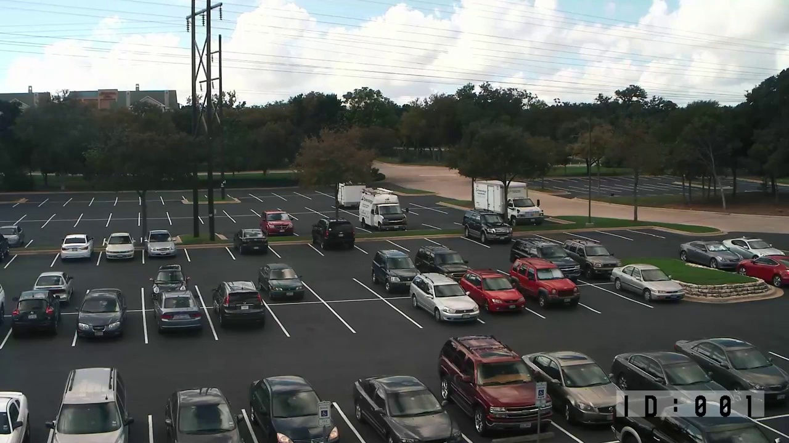

# 🅿️ Real-Time Parking Lot Detector (OpenCV)

A computer vision project to detect parked and empty spaces in a parking lot using OpenCV.

## 🎥 Source Footage

- **YouTube video**: [https://www.youtube.com/watch?v=U7HRKjlXK-Y&t=149s](https://www.youtube.com/watch?v=U7HRKjlXK-Y&t=149s)  
- **Reference blog**: [https://olgarose.github.io/ParkingLot/](https://olgarose.github.io/ParkingLot/)

## ✅ Features So Far

- 📽️ Extract a frame from a video
- 🖼️ Manually draw parking spaces using 4-point polygons
- 💾 Save labeled spots to `parking_positions.npy`
- 📄 Export a human-readable `parking_summary.txt` file with spot count

## 📦 Project Files & Their Purpose

| File                             | Description |
|----------------------------------|-------------|
| `extract_frame.py`               | Extracts a representative frame from your video and saves it as `frame_for_parking.jpg`. Used for labeling. |
| `frame_for_parking.jpg`          | A still frame from the parking lot footage. You’ll use this to manually define parking spaces. |
| `select_spot.py`                 | Interactive GUI tool. Click 4 corners to form each parking space polygon. Press `s` to save, `q` to quit. |
| `parking_positions.npy`          | Stores the list of all saved parking spot coordinates as polygons. Used later for detection. |
| `requirements.txt`               | Python dependencies needed to run the project (NumPy, OpenCV). Install with `pip install -r requirements.txt`. |
| `README.md`                      | Project documentation, setup instructions, and usage guide. |

## 📸 Screenshots

**Extracted Frame from Parking Lot Footage**   

**Manual Parking (Only few for reference)**   

