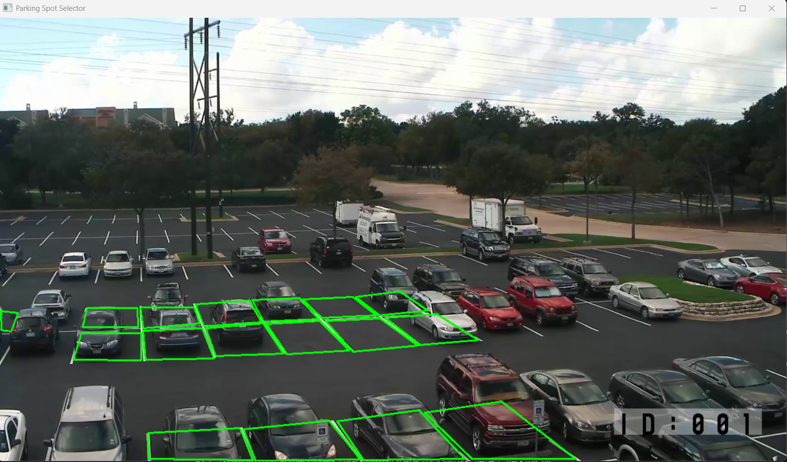

# 🅿️ Real-Time Parking Lot Detector (OpenCV)

A computer vision project to detect parked and empty spaces in a parking lot using OpenCV.

---

## 🎥 Source Footage

- **YouTube video**: [https://www.youtube.com/watch?v=U7HRKjlXK-Y&t=149s](https://www.youtube.com/watch?v=U7HRKjlXK-Y&t=149s)  
- **Reference blog**: [https://olgarose.github.io/ParkingLot/](https://olgarose.github.io/ParkingLot/)

---

## ✅ Features So Far

- 📽️ Extract a frame from a video
- 🖼️ Manually draw parking spaces using 4-point polygons
- 🎯 Select a clean floor patch as a reference using the same 4-point method
- 💾 Save labeled spots to `parking_positions.npy`
- 📄 Export a human-readable `parking_summary.txt` with spot count
- 🚘 Detect occupancy in parking spots using color difference with a reference floor patch
- 🎥 Run the detector on full videos, frame-by-frame

---

## 📦 Project Files & Their Purpose

| File                             | Description |
|----------------------------------|-------------|
| `frame.py`                       | Extracts a representative frame from your video and saves it as `frame_for_parking.jpg`. Used for labeling. |
| `select_spot.py`                 | Interactive GUI tool. Click 4 corners to form each parking space polygon. Press `s` to save, `q` to quit. |
| `select_floor.py`                | GUI tool to click 4 corners of a clean floor patch for use as a reference. Saves to `floor_reference.jpg` and `.npy`. |
| `detect_parking_frame.py`        | Detects parking occupancy in a single frame by comparing each spot to the floor reference patch. |
| `detect_parking_video.py`        | Applies the above logic to an entire video, frame by frame. Optional export available. |
| `requirements.txt`               | Python dependencies needed to run the project (NumPy, OpenCV). Install with `pip install -r requirements.txt`. |
| `README.md`                      | Project documentation, setup instructions, and usage guide. |

---

## 📸 Screenshots

**1. Extracted Frame from Parking Lot Footage**  

**2. Manual Parking Space Drawing (Only a few for reference)**  

**3. Final Detection Output**  
  
  

---

## 🔻 Limitations & Known Issues

While the current detection approach is fast and effective, it has some known limitations:

- 🎚 **Fixed color difference threshold**: The detection relies on a manually tuned color difference threshold, which may not generalize across different lighting conditions, weather, or times of day.

- 🚘 **Black cars**: Black or very dark vehicles can appear visually similar to the floor (especially asphalt), making them harder to distinguish using color-based methods alone.

- 🧭 **Bad parking / off-angle cars**: If a car is not fully inside the designated polygon, the detector may misclassify it as empty due to visible floor area.

### 🔧 Possible Improvements:
- Use per-spot background references instead of one universal floor patch
- Dynamically adjust thresholds based on lighting
- Combine with edge detection or ML-based features